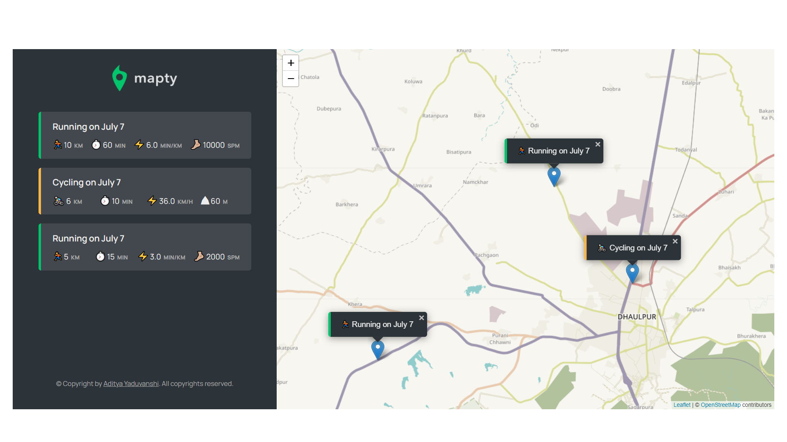

# Mapty
 

  

  <h1 align="center">Mapty  </h1>

## About the project
Mapty App - Built with Vanilla Javascript and by using Leaflet library. 
Its structure is built with OOP using classes and objects. 
This website is used to see all of your workouts places on map 

## Screenshot 

## Link to website
   Live Demo - https://mapty-byaditya.netlify.app/

##  Features
<ol>
  <li> Displaying Map using Leaflet library</li>
  <li>Position automatically obtained by the browser using Geolocation API</li>
  <li>Show workouts on map</li>
<li>Move to marker when workout is clicked</li>
  <li>Saving workouts to localstorage</li>
</ol>
## Languages used
<ul>
  <li>Javascript</li>
  <li>HTML</li>
  <li>CSS</li>
  </ul>
  
  
## Contact me
<ul>
  <li>Created by --  Aditya Yaduvanshi</li>
  <li>Twitter -- <a href="https://twitter.com/fixslyr">Fixslyr</a>
    <li>Instagram -- <a href="https://www.instagram.com/imtheaddy/">Aditya Yaduvanshi</a>
      <li>Linkedin -- <a href="https://www.linkedin.com/in/theaditya-yaduvanshi-/">Aditya Yaduvanshi</a>
  </ul>    
      
